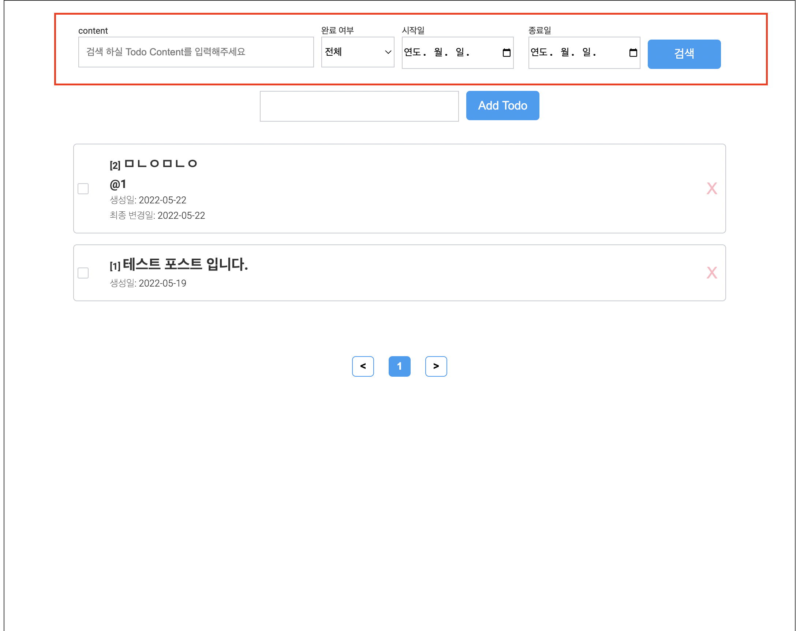
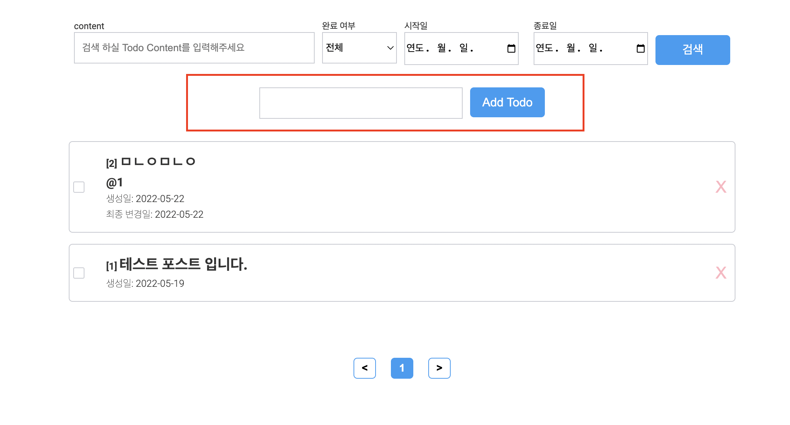
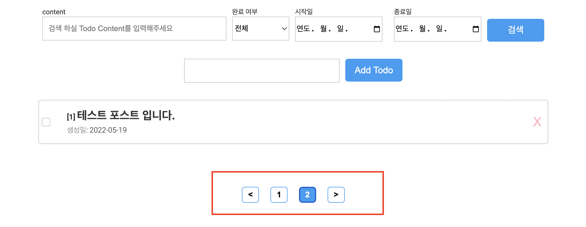
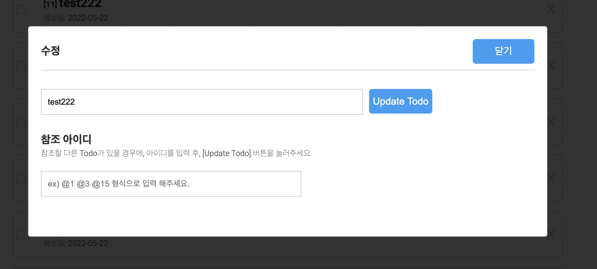

# 와이즐리 Front end 과제

### 과제 참고 내용

- 기간: 2022-05-15(일) ~ 2022-05-22(일) 7일

---

### 세팅

- Back-end
   - Language & Library: Javascript, Node.js (express)
   - DB: Mysql (V. 8.0.29)

- Front-end
   - Language & Library: Typescript, React
   - 전역상태 관리: Context API
   - 스타일링: Styled-component
   - Etc: Eslint, Prettier 등등

---

### 실행 방법
(필수) mysql 8버전 이상을 설치 해주어야 합니다.

- 프로젝트를 실행하기 전, 다음과 같이 mysql table을 생성 시켜 줍니다.

중요) 경로는 /wisely_project 에서 다음과 같이 실행합니다.

```js
$ npm run migrate
```

위와같이 실행하면 다음과 같이 비밀번호를 입력하라고 나옵니다.

```js
Enter password: 
```
DB를 설치할때 사용자가 지정한 비밀번호로 입력 합니다. 만약 로컬 db에 접속이 안되는 경우, 해당 비밀번호를 수정해주세요.

그러면 로컬에 wisely_test 라는 테이블이 생성 됩니다.

그리고 /server/config/database.js 파일에서 패스워드를, DB를 설치할 때 사용자가 지정한 비밀번호로 수정 합니다.

이제 다음과 같이 터미널에 입력하여 프로젝트를 실행합니다.

/wisely_project 경로

```js
$ npm run start // 프론트, 백 같이 실행 시키는 명령어
```

프론트 또는 백을 단독으로 실행 시키기 위해서는 다음과 같이 입력해줍니다.

```js
$ npm run server // 서버
$ npm run client // 프론트
```

만약 실행 하였는데 서버 DB에서 오류가 발생하면 다음을 참조해주세요.

### 참조 (외부 접속이 허용되었는지 확인)

mysql 쿼리를 실행하기 위해서 다음과 같이 입력합니다.

```js
$ mysql -u root -p
```

```
mysql > select host, user from mysql.user;
```

위와같이 host에 localhost 이외의 주소가 없다면 외부 접속 허용이 불가능함

MySQL에서 % 는 와일드 카드로 사용된다.
서버와 같은 외부에서 허용하도록 하려면 host주소에 %로 지정해주면 됩니다.

```sql
# MySQL8부터는 이렇게...
mysql> CREATE USER 'root'@'%' IDENTIFIED BY 'root';
Query OK, 0 rows affected (0.01 sec)

mysql> GRANT ALL PRIVILEGES ON *.* TO 'root'@'%' WITH GRANT OPTION;
Query OK, 0 rows affected (0.00 sec)

mysql> FLUSH PRIVILEGES;
Query OK, 0 rows affected (0.00 sec)
```

추가로...

MySQL 8.0에서는 MySQL 패스워드 플러그인 "caching_sha2_password" 때문에 클라이언트 프로그램에서 종종 지금과 같은 에러가 발생합니다.

다음과 같이 SQL 문으로 자신의 데이터베이스의 패스워드 플러그인을 확인할 수 있습니다.

```sql
mysql> select host, user, plugin, authentication_string from mysql.user; 
```

그리고 "mysql_native_password" 플러그인으로 바꿔주면 정상 작동할 것입니다.

```sql
mysql> ALTER USER 'root'@'%' IDENTIFIED WITH mysql_native_password BY 'root';
```

---

### 설명

- 제일 최 상단에는, 입력한 Todo 에 대해 검색하는 영역입니다.



제목, 완료 여부, 생성일을 기준으로 기간 검색을 할 수 있습니다.

- 아래 부분에는 Todo List의 content를 추가 할 수 있습니다.



- 그리고 아래에는 추가한 내용들에 대한 리스트 영역입니다.

- 또한, 한 페이지당 10개의 리스트가 나오며, 10개가 넘어갈 경우에는 페이지를 이동하여 다른 리스트들을 확인할 수 있습니다.



- 컨텐츠를 클릭하여, 내용을 수정하거나, 참조할 아이디를 추가할 수 있습니다.



- 리스트 우측에 X 버튼을 눌러 삭제를 할 수 있습니다.

- 체크 박스를 클릭하여, 완료 및 미완료 로 상태를 변경 할 수 있습니다.
(만약 참조한 아이디가 모두 완료상태가 아니라면, 체크가 되지 않습니다.)
